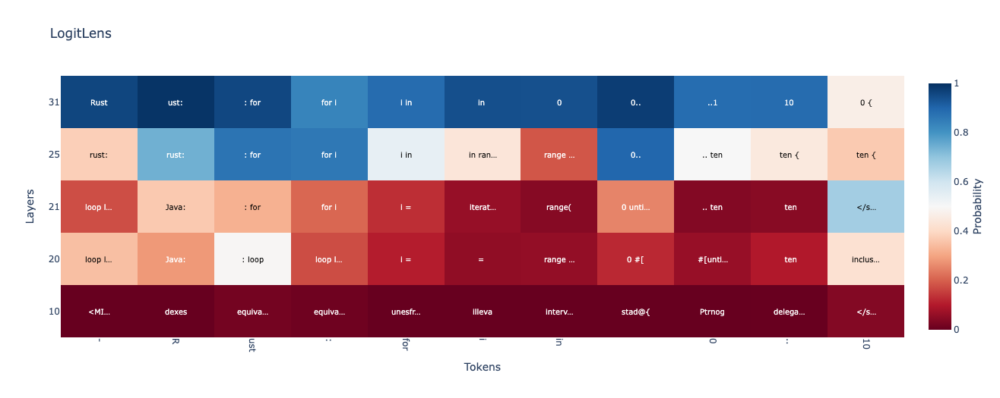

# code-lens 
[](https://colab.research.google.com/github/cisnlp/code-lens/blob/main/interactive.ipynb)

Code-Lens: On the Latent Language of Code in Code Language Models





## Look Ahead in Logit Lens

In this work, we use the logit lens[^1] rather than the tuned lens[^2]. The tuned lens would undermine our goal of understanding whether the models, when prompted with `X`, take a detour through `Y` internal states before outputting the `X` text. Since the tuned lens is specifically trained to map internal states to the final `X` next-token prediction, it eliminates our signal of interest.

#### Logit Lens

Consider a pre-LayerNorm transformer model $\mathcal{M}$ that consists of $L$ layers. We know that some vectors in embedding space make sense when converted into vocabulary space:

- The very first embedding vectors are just the input tokens.
- The very last embedding vectors are just the output logits.

What about the embedding vectors of the $l$ th layer? Transformer model $\mathcal{M}$ can be divided into two sections:
- $\mathcal{M}\_{\leq \ell}$: This portion includes all layers up to and including layer $l$, which maps input tokens to hidden states.
- $\mathcal{M}\_{>\ell}$: This portion encompasses all layers after $l$, which convert hidden states into logits.

The update mechanism for a transformer layer at index $l$ is given by:


```math
\mathbf{h}^{(\ell+1)} = \mathbf{h}^{(\ell)} + F_{\ell}(\mathbf{h}^{(\ell)}),
```

where $F\_{\ell}$ is the residual output of layer $l$. 
If we do this recursively, we can express $\mathcal{M}\_{>\ell}$ as a function of $\mathbf{h}^{(\ell)}$:


```math
\mathcal{M}_{>\ell}(\mathbf{h}^{(\ell)}) = \mathrm{LayerNorm}\left[\mathbf{h}^{(\ell)} + \sum_{\ell'=\ell}^{L} F_{\ell'}(\mathbf{h}^{(\ell')})\right] W_U,
```

where $W_U$ is the unembedding matrix that projects the final hidden states into logits.
The core idea of the Logit Lens is to set the residual updates to zero, focusing solely on the hidden state from layer $l$:

```math
\mathcal{LogitLens}(\mathbf{h}^{(\ell)}) = \mathrm{LayerNorm}[\mathbf{h}^{(\ell)}] W_U.
```

Then, softmax is applied to these logits to calculate the probabilities of the next output token $P(x\_{n+1} | \mathbf{h}^{(\ell)}\_n)$.


#### How to look at more tokens ahead?

We use beam search to select $j$ the sequence of tokens $(x_{n+1}, \dots, x_{n+j})$ with the highest conditional probability from the vocabulary.

```math
P(x_{n+1}, \dots, x_{n+j} | h^{(\ell)}_n) = \prod_{k=1}^j P(x_{n+k} \mid h^{(\ell)}_n, x_{n+1}, \dots, x_{n+k-1})
```


[^1]: https://www.lesswrong.com/posts/AcKRB8wDpdaN6v6ru/interpreting-gpt-the-logit-lens  
[^2]: https://github.com/AlignmentResearch/tuned-lens


## Code Keywords and Builtins

We included keywords and builtins for different programming languages in the [code_lens/utils/keywords](code_lens/utils/keywords).

Builtins include: primitive types, macros, modules, collections, containers, and builtin functions, excluding keywords.


